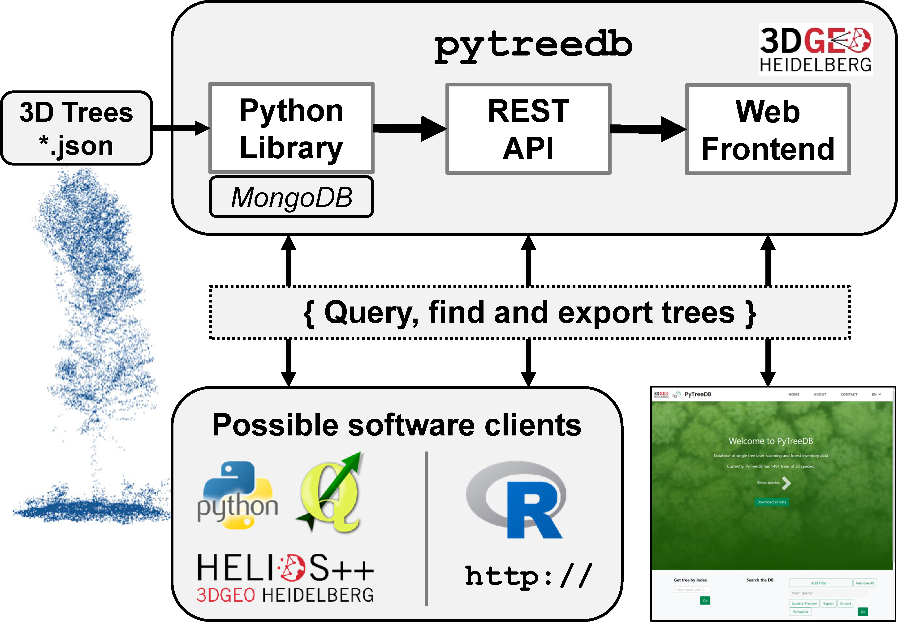

# pytreedb

`pytreedb` is a 🐍 Python software package providing an object-based library to provide a simple database interface and REST API of vegetation tree objects that were captured as 3D point clouds. The main objective is to provide a Python library for the storage and sharing of single tree-based point clouds and all relevant (forest intentory) tree measurements. The tree data include all tree related information, measurements, metadata, geoinformation and also links to the 3D point clouds linked in any file format (e.g. LAS/LAZ). `GeoJSON` including all tree-related information is used as data format  for data exchange and visualization with other software (e.g. direct import into most GIS). Thereby view and modification of the tree datasets (*.geojson) is straightforward.

[MongoDB](https://www.mongodb.com/) is used as database backend via the [PyMongo](https://pypi.org/project/pymongo/) driver. This enables scaling to large global datasets, e.g. connecting to [MongoDB Atlas Cloud](https://www.mongodb.com/cloud/atlas) for big datasets. Working only locally using a local MongoDB installation is also possible, if the database is only needed during runtime of data processing and sharing on the Web is not required.

## Main Features

`pytreedb` has three main components and usage directions:

1. **Python library**: In case you need to access the tree database in your Python scripts during runtime of data processing and analysis. 
2. **REST API**: In case you want to provide your datasets to any software over a REST API. The `pytreedb` server application is using the [Flask](https://pypi.org/project/Flask/) framework.
3. **Web frontend**: In case you want to share your valuable tree data to the community. Based on the REST API we showcase in this repository how a Web frontend can be easily implemented, which provides several query options, data export and also map views of query results.





The [`PyTreeDB`](pytreedb/db.py) class is the starting point and the core component. It is responsible, e.g., for 
- data **import**, data **export**, data validation, automatic sync with MongoDB
- all kind of **queries**. 

The `Python` REST interface and all clients, such as the web frontend, simply use the methods and functionality of the Python class.

:information_source: Please refer to our [publication](## Citation) for further details on the scientific concept behind and software design of this open source project. 

## 💻 Download and Installation

### Installation
Install and update using [pip](https://pypi.org/):

`$ pip install -U pytreedb`

### Using Anaconda / Conda Environment
Simply use the given Conda environment file [environment.yml](environment.yml) provided in this distribution, which contains all dependencies to run and build resources.

`$ conda env create --file environment.yml`

### Connect to MongoDB
xxx
Install 

### Known Issues
- add here

### Software Dependencies

xx

## :information_source: Documentation of software usage

As a starting point, please have a look to the [examples](examples) and [notebooks](Jupyter Notebooks) available in the repository. Further, each of the subfolders contains a readme.md with respective details on the repository section.

For running the Python scripts and the Jupyter Notebooks, you need to specify the information (mongodb URI, database name and connection) for connecting to the MongoDB in a `.env` file. Use the template file [sample.env](sample.env), add your values, and save the file as `.env` in the root directory.

==> _CREATE VIDEO or GIFs of usage as code (notebook slideshow) and as server on 3DGeo Youtube and put here._

### Use the pytreedb class
Usage: 


### Run it as a server
Usage from main directory in command line:
```
set FLASK_APP=webserver/main.py
python -m flask run
```

### GeoJSON Template

x

## Test Data
xxx

## Citation
Please cite the following publication when using pytreedb in your research and reference the appropriate release version. All releases of pytreedb are listed on Zenodo where you will find the citation information including DOI.

```
article{pytreedb,
author = {Bernhard Höfle and Jiani Qu and Lukas Winiwarter and Hannah Weiser and Jannika Schäfer and Fabian E. Fassnacht}
title = {pytreedb: library for point clouds of tree vegetation objects},
journal = {The Journal of Open Source Software},
year = {2022},
number = {},
volume = {-},
doi = {-},
url = {-},
} 
 ```
## Funding / Acknowledgements
The initial software development was supported by the DFG - German Research Foundation (Grant no. 411263134) within the research project [SYSSIFOSS](https://uni-heidelberg.de/syssifoss).

## Contact / Bugs / Feature Requests

You think you have found a bug or have specific request for a new feature. Please open a new issue in the online code repository on Github. Also for general questions please use the issue system. 

Scientific requests can be directed to the [3DGeo Research Group Heidelberg](https://uni-heidelberg.de/3dgeo) and its respective members.

## 📜 License

See [LICENSE.md](LICENSE.md)
