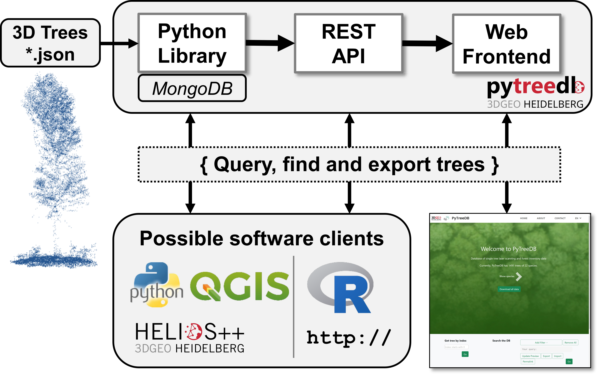

# pytreedb :snake: :deciduous_tree:

`pytreedb` is a `Python` software package providing an object-based library to provide a simple database interface and REST API of vegetation tree objects that were captured as 3D point clouds. The main objective is to provide a Python library for the storage and sharing of single tree-based point clouds and all relevant (forest intentory) tree measurements. The tree data include all tree related information, measurements, metadata, geoinformation and also links to the 3D point clouds linked in any file format (e.g. LAS/LAZ). `GeoJSON` including all tree-related information is used as data format  for data exchange and visualization with other software (e.g. direct import into most GIS). Thereby view and modification of the tree datasets (*.geojson) is straightforward.

[MongoDB](https://www.mongodb.com/) is used as database backend via the [PyMongo](https://pypi.org/project/pymongo/) driver. This enables scaling to large global datasets, e.g. connecting to [MongoDB Atlas Cloud](https://www.mongodb.com/cloud/atlas) for big datasets. Working only locally using a local MongoDB installation is also possible, if the database is only needed during runtime of data processing and sharing on the Web is not required.

## Main Features

`pytreedb` has three main components and usage directions:

1. **Python library**: In case you need to access the tree database in your Python scripts during runtime of data processing and analysis. 
2. **REST API**: In case you want to provide your datasets to any software over a REST API. The `pytreedb` server application is using the [Flask](https://pypi.org/project/Flask/) framework for local(host) usage and we provide instructions to setup for production deployment with [Apache WGSI](webserver#deployment-for-production).
3. **Web frontend**: In case you want to share your valuable tree data to the community. Based on the REST API we showcase in this repository how a Web frontend can be easily implemented, which provides several query options, data export and also map views of query results. A showcase presenting the tree data of [Weiser et al. 2022](https://doi.org/10.5194/essd-2022-39) is given on http://pytreedb.geog.uni-heidelberg.de/.





The [`PyTreeDB`](pytreedb/db.py) class is the starting point and the core component. It is responsible, e.g., for 
- data **import**, data **export**, data validation, automatic sync with MongoDB
- all kind of **queries**. 

The `Python` REST interface and all clients, such as the web frontend, simply use the methods and functionality of the Python class.

:information_source: Please refer to our [scientific publication](#citation) for further details on the scientific concept behind and software design of this open source project. 

## 💻 Download and Installation

### Installation
Install and update using [pip](https://pypi.org/) for 1) core library and 2) server library using the core library:

`$ pip install -U pytreedb`

`$ pip install -U pytreedb-server`

### Using Anaconda Environment
Simply use the given `Anaconda` environment file [environment.yml](environment.yml) provided in this distribution, which contains all dependencies to run and build resources.

`$ conda env create --file environment.yml --force`

### Connect to MongoDB (localhost / server / Atlas cloud)
`pytreedb` requires a working connection to a `MongoDB` database. It does not matter where the MongoDB is running as connection is simply made via `pymongo` (see code in [examples](examples) and our [Jupyter notebooks](notebooks)). We successfully tested localhost, server and [MongoDB Atlas cloud](https://www.mongodb.com/basics/mongodb-atlas-tutorial) connections. For your own MongoDB installation, just follow the [official installation instructions](https://docs.mongodb.com/manual/installation/)).

The required **MongoDB connection** with credentials is made with a `.env` file (_yes, the file has no name_) that you place in the folder of your Python scripts or search path. [dotenv](https://pypi.org/project/python-dotenv/) is used for providing credentials - 1) URI to server, 2) database and 3) collection name - outside your source code (see [sample.env](sample.env) as template).

Example `.env` file for connection to local MongoDB installation. ℹ️ Replace <database_name> and <collection_name> with your settings:
```
CONN_URI = "mongodb://127.0.0.1:27017/"
CONN_DB = "<database_name>"
CONN_COL = "<collection_name>"
```

Example CONN_URI in `.env` file for connection to MongoDB Atlas cloud where the respective settings need to be replaced with yours:

```
CONN_URI = "mongodb+srv://<username>:<password>@<your_cluster_details>.mongodb.net/<database_name>?retryWrites=true&w=majority"
```

### Software Dependencies

All dependencies (i.e. required third-party Python packages) are listed in the Anaconda [environment.yml](environment.yml) definition and can be installed with [conda / pip](#using-anaconda-environment). When creating the conda environment from our definition file, all dependencies are resolved.

## Documentation of software usage

### `PyTreeDB` class :snake:
As a starting point, please have a look to the [examples](examples) and [Jupyter Notebooks](notebooks) available in the repository. Further, each of the subfolders contains a readme.md with respective details on the repository section.


### Run it as a API server :computer:
In order to provide a REST API to share your tree data you can use `pytreedb` in server mode. After installation of the `pytreedb-server` Python package you can follow the instructions here [webserver/README.md](webserver/README.md).

### Run it as a web server and frontend
An example web frontend instance is running here: http://pytreedb.geog.uni-heidelberg.de/. The respective instructions and codes to install a webpage via the `pytreedb-server` Python package can be found in the webserver code section of `pytreedb`: [pytreedb/webserver](webserver/README.md). Web frontend codes can be easily adapted to your needs - see web programming codes in [static](webserver/pytreedb_server/static) and [templates](webserver/pytreedb_server/templates).

### Use it as via the REST API also from other programming languages (e.g. R stats)
Straightforward access from any programming language is made possible via the REST API. We provide examples scripts for http API access, e.g. for R statistics in [examples_api](examples_api). The [R function example](examples_api/example.R) allows simple query and also download of the LAZ files for all trees of the query result.


### GeoJSON Format and Template
An example tree is given in [data/geojson/AbiAlb_BR03_01.geojson](data/geojson/AbiAlb_BR03_01.geojson) and the GeoJSON template for tree objects is defined here [pytreedb/db_conf.py](pytreedb/db_conf.py).

The single tree information (incl. URLs to the point clouds) has to be provided as `GeoJSON` file per tree. We use a straightforward format that is a valid GeoJSON and can be opened with any GIS software. The main idea of the pytreedb GeoJSON format is to define a minimum set of tree metadata, which can be extended by any further data that is needed by the user. Thus, it is just required that your GeoJSON file complies with the minimum set to enable import into the database. The [`PyTreeDB`](pytreedb/db.py) class offers the method `validate_json` to check the validity of the file. Also the import of files checks the validity automatically and will only import tree objects that are conformal with the defined template. The used [GeoJSON template](pytreedb/db_conf.py) can also be modified for your use case and application. Note that modification (e.g. removal of mandatory fields from our template) will - most probably - require modifications for the API and web frontend component. 

## Published Test Data
In this repository we provide metadata (incl. links to point clouds) of 1481 trees that have been captured with airborne (ALS), UAV-borne (ULS) and terrestrial (TLS) laser scanning as well as field inventory data. Please check our data publication by *Weiser et al. 2022* in *Earth System Science Data* ([https://doi.org/10.5194/essd-2022-39](https://doi.org/10.5194/essd-2022-39)) for full details.

The test data is provided in [`data`](data) as 1) single [GeoJSON files and as ZIP archive](data/geojson/), and 2) also as serialized and zipped [pytreedb database dump](data/db_dump) files that can be directly imported and used to start the API server.

[](https://doi.org/10.5194/essd-2022-39)

## Citation
Please cite the following publication when using pytreedb in your research and reference the appropriate release version. All releases of pytreedb are listed on Zenodo where you will find the citation information including DOI. 

```
article{pytreedb,
author = {Bernhard Höfle and Jiani Qu and Lukas Winiwarter and Hannah Weiser and Vivien Zahs and Jannika Schäfer and Fabian E. Fassnacht}
title = {pytreedb: library for point clouds of tree vegetation objects},
journal = {},
year = {2022},
number = {},
volume = {-},
doi = {-},
url = {https://github.com/3dgeo-heidelberg/pytreedb},
} 
 ```
## Funding / Acknowledgements
The initial software development was supported by the **DFG - German Research Foundation** (Grant no. 411263134) within the research project [SYSSIFOSS](https://uni-heidelberg.de/syssifoss).

[](https://www.dfg.de/en/)

## Contact / Bugs / Feature Requests

You think you have found a bug or have specific request for a new feature. Please open a new issue in the online code repository on Github. Also for general questions please use the issue system. 

Scientific requests can be directed to the [3DGeo Research Group Heidelberg](https://uni-heidelberg.de/3dgeo) and its respective members.

## 📜 License

See [LICENSE.md](LICENSE.md)
