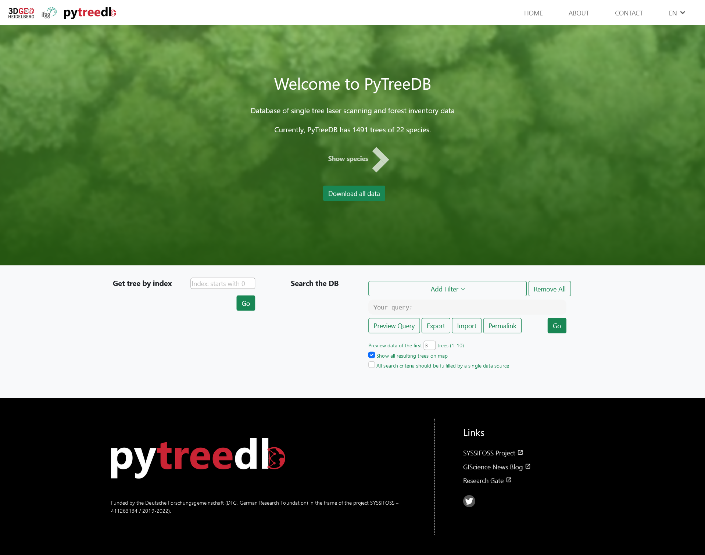

# pytreedb-Server

This package provides a webserver as a frontend to a `pytreedb` instance.



## Prerequisites
- Python packages:
  - `pytreedb`
  - `flask`
  - `dotenv`
  
## Deployment for local dev
### Setup using `.env`
We use the `dotenv` package to configure the server. Both `pytreedb` and `flask` parameters should be written to
the `.env`-File in the current directory: 
```
# path of the pytreedb package (if not installed via PIP)
PYTREEDB_LOCATION="../pytreedb"
# local filename for database file
PYTREEDB_FILENAME="syssifoss.db"
# if set, download (and overwrite local file) data from this URL
PYTREEDB_DOWNLOAD="https://heibox.uni-heidelberg.de/f/05969694cbed4c41bcb8/?dl=1"
# connection string to mongodb (e.g. 127.0.0.1, or "mongodb+srv://..." if using MongoDB Cloud)
CONN_URI = ""
# database name to connect to
CONN_DB = ""
# collection to connect to
CONN_COL = ""
FLASK_ENV=development
FLASK_SERVER_NAME=0.0.0.0:5001
```

### Configuring pytreedb dataset
The dataset is not a prerequisite. Please follow the instructions after getting Flask to running on your machine.


### Serve the webserver locally
Under the root folder of pytreedb, run:

```
conda activate pytreedb
set FLASK_APP=webserver/main.py
python -m flask run
```

## Deployment for production
Note that Flask is not suitable for production. 
See https://flask.palletsprojects.com/en/2.0.x/deploying/ for deployment options


## Usage
In the "Get tree by index" search box, you can directly search for a tree according to its index.

In the "Search the DB" area, we predefined following filters:

| Filter  | Corresponding fields|
| ------- |:-------------:|
| Species | properties.species |
| Mode    | properties.data.mode |
| Canopy  | properties.data.canopy_condition |
| Quality | properties.data.quality |
| Source  | properties.measurements.source |
| DBH     | properties.measurements.DBH_cm |
| Height  | properties.measurements.height_m |
| CrownDia. | properties.measurements.mean_crown_diameter_m |

The filters have the default logic operator AND. You can toggle it between AND/OR by clicking on the preceding button of each filter.

We also allow brackets with a depth of 3. By moving a filter to the right, a bracket will be added to embrace the previous filter with the current filter. If you are still unfamiliar to our search interface and not sure if you are configuring the search correctly, just press "Update Preview" button to check if it aligns to your desired query.

You can export your query as a Json file to save to local, and import such a query for future use. Clicking on the "Permalink" button will also copy a link to your current query.


## API
GET methods:

| Request  | Description |
| ------- |:-------------:|
| /stats | The number of trees and species in DB |
| /listspecies | Unique species names in DB |
| /sharedproperties | A list of all object.properties that are shared among all objects |
| /getitem/\<index> | Get a specific tree by its index |

POST methods:

| Request  | Description | Example Message|
| ------- |-------------|:-------------:|
| /search | Search based on a given query. Returns a Json objects containing search results |  {"properties.species": "Abies alba"} |
| /exportcsv | Download results as csv for the given query |  {"properties.species": "Abies alba"} |

See [example_queries](../examples/example_queries.py) for more examples on how to query.